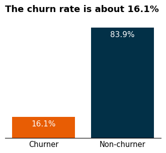
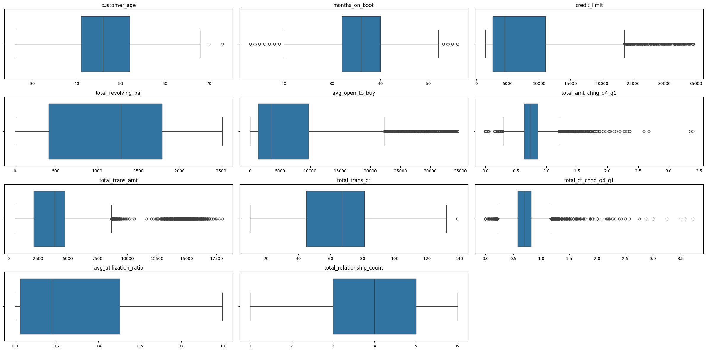
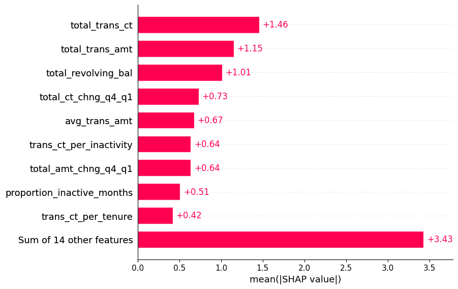
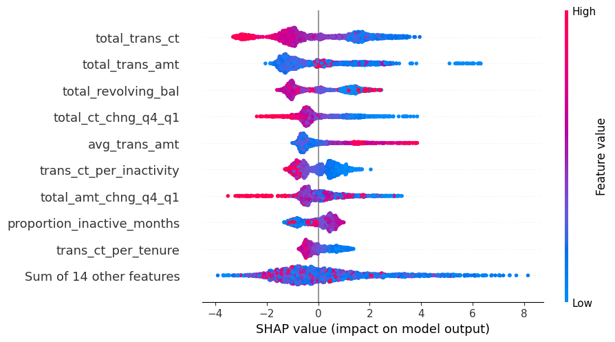

# Relatório Final: Previsão de Churn de Cartão de Crédito

Este documento apresenta a metodologia aplicada e a visualização de dados com os resultados obtidos no projeto de previsão de cancelamento de cartão de crédito (*churn*), como parte da entrega final solicitada.

## 1. Coleta de Dados
Os dados utilizados para este projeto são provenientes de um dataset público disponível no Kaggle chamado **Credit Card Customers**. O conjunto original contém diversas informações demográficas (idade, escolaridade, estado civil, renda) e comportamentos transacionais (quantidade de transações, limite de crédito, meses inativos) dos clientes.
- **Processamento Inicial:** A lógica de extração gerencia a descompactação segura do arquivo `archive.zip` bruto.
- **Limpeza e Preparação:** A etapa de coleta e limpeza garantiu a remoção estrita de colunas que causavam **vazamento de dados** (*data leakage*), especificamente colunas de predição incluídas erroneamente no conjunto bruto. Além disso, removemos identificadores únicos como `CLIENTNUM` que não possuem valor preditivo.

## 2. Modelagem
A abordagem de modelagem foi desenhada especialmente para tratar um problema clássico de **classes desbalanceadas** no contexto bancário (muito mais clientes ativos do que cancelados).
- **Engenharia de Features:** Criamos novas colunas (ex: proporção de transações) para enriquecer o algoritmo. Realizamos a codificação de variáveis categóricas usando *Ordinal Encoding* (para classes ordinais como escolaridade) e *Target Encoding*.
- **Treinamento (LightGBM):** Utilizamos o algoritmo **LightGBM**, aplicando o hiperparâmetro `class_weight='balanced'` e validando o modelo por meio de *Stratified K-Fold*.
- **Rastreamento:** Todo o processo foi submetido a práticas de MLOps, rastreando hiperparâmetros, métricas e o próprio modelo treinado utilizando a integração **MLflow + DagsHub**.

## 3. Conclusões e Visualização de Dados
Os resultados obtidos durante o treinamento foram excelentes. A escolha de métricas focadas em desbalanceamento confirmou a alta eficácia preditiva:
- **ROC-AUC Score:** O modelo alcançou um score de **0.9915**. Na prática, isso indica que há quase 100% de chance do modelo classificar corretamente a probabilidade de um cliente prestes a cancelar como sendo maior do que a de um cliente fiel.
- **PR-AUC Score:** O modelo atingiu **0.9649**, apontando alta precisão na classe minoritária sem aumentar excessivamente os falsos positivos.

Com base nisso, conclui-se que o modelo está maduro e altamente capaz de sustentar estratégias proativas de retenção de clientes em produção via API (FastAPI).

### Visualizações e Resultados
Como os estudos, levantamentos e predições foram aprofundados nos notebooks interativos, as visualizações e detalhamentos mais complexos encontram-se dentro da pasta **`images/`**. Lá estão arquivados os gráficos de Análise Exploratória e os de avaliação e treinamento de Modelos, como matrizes de confusão e curvas ROC que justificam detalhadamente a escolha de nossas *features* e dos parâmetros do modelo.

#### Análise Exploratória (Insights Iniciais)
Abaixo estão exemplos dos padrões encontrados durante a análise dos dados brutos:

> **Observação:** Esta visualização ilustra a distribuição inicial da nossa base. Através dela, conseguimos identificar características e comportamentos que já diferem visivelmente entre clientes ativos e aqueles propensos ao cancelamento.

> **Observação:** Aqui destacamos o contraste no engajamento financeiro (como número de transações e limite de crédito utilizado). Fica claro que clientes que interagem menos com os serviços do banco possuem taxas de *churn* marcadamente superiores.

#### Avaliação do Modelo (Métricas e Importância)
Abaixo está o comportamento do nosso modelo em prever a probabilidade de um cliente cancelar:

> **Desempenho (ROC/PR-AUC):** O gráfico acima demonstra a performance robusta do LightGBM. A curva evidencia a capacidade do modelo de isolar a classe minoritária (*churners*) com altíssima taxa de acerto, o que garante eficácia nas futuras campanhas de retenção.

> **Feature Importance:** Esta análise desvenda quais atributos mais pesam na decisão preditiva. Fica evidente que as variáveis relacionadas à atividade transacional recente (volume e quantidade de compras) são os maiores indicativos de cancelamento, muito mais do que fatores puramente demográficos (idade, estado civil).

*(Você pode consultar outros resultados, matrizes de confusão e gráficos completos diretamente nos notebooks `01_analise_exploratoria.ipynb` e `02_modelagem.ipynb` ou na pasta de imagens extraídas)*
